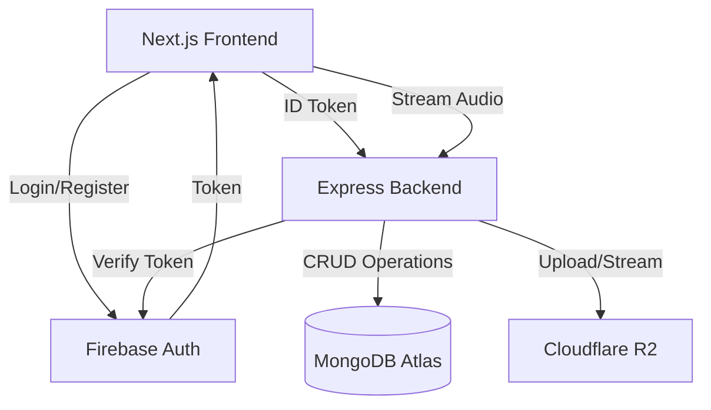
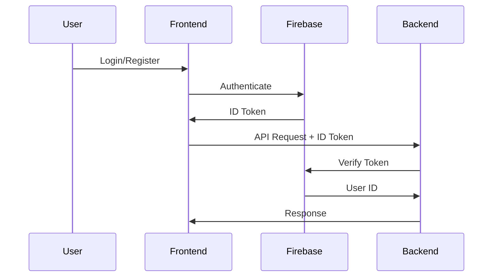
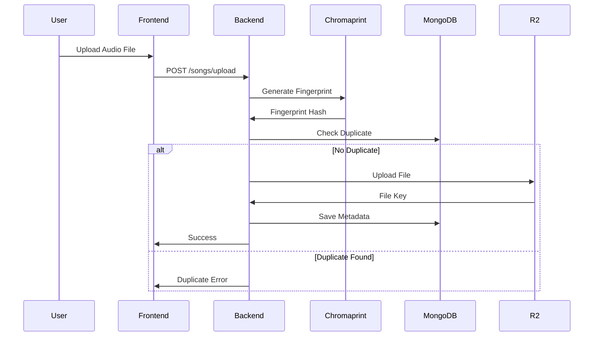

# Design Document

## Overview

The Online Music Player is a full-stack web application that provides Spotify-like music streaming capabilities. The system consists of a Next.js frontend, Node.js/Express backend, MongoDB database, and Cloudflare R2 cloud storage. The architecture emphasizes stateless API design, efficient duplicate detection through audio fingerprinting, and scalable content delivery.

### Technology Stack

**Frontend:**

- Next.js (React with Server-Side Rendering)
- Tailwind CSS for styling
- Firebase Authentication SDK
- HTML5 Audio API

**Backend:**

- Node.js with Express.js
- TypeScript
- Firebase Admin SDK for token verification
- Mongoose ODM for MongoDB
- Multer for file upload handling
- Chromaprint (fpcalc) for audio fingerprinting
- AWS SDK for S3-compatible storage (Cloudflare R2)

**Infrastructure:**

- MongoDB Atlas (cloud database)
- Cloudflare R2 (object storage)
- Firebase Authentication

## Architecture

### High-Level Architecture



### Authentication Flow



### File Upload Flow



## Components and Interfaces

### Frontend Components

#### 1. Authentication Module

- **Purpose**: Handle user registration and login
- **Dependencies**: Firebase Authentication SDK
- **Key Functions**:
  - `signUp(email, password)`: Register new user
  - `signIn(email, password)`: Authenticate user
  - `getIdToken()`: Retrieve current user's ID token
  - `signOut()`: Log out user

#### 2. Audio Player Component

- **Purpose**: Provide playback interface
- **Dependencies**: HTML5 Audio API
- **Key Features**:
  - Play/pause controls
  - Seek bar
  - Volume control
  - Current song display (title, artist)
- **Props**:
  - `songId`: ID of song to play
  - `songMetadata`: Object containing title and artist

#### 3. Upload Component

- **Purpose**: Handle file selection and upload
- **Key Functions**:
  - `handleFileSelect(file)`: Validate and prepare file
  - `uploadSong(file, metadata)`: Send file to backend
  - `showProgress(percentage)`: Display upload progress

#### 4. Playlist Manager Component

- **Purpose**: Display and manage playlists
- **Key Functions**:
  - `fetchPlaylists()`: Load user playlists
  - `createPlaylist(name)`: Create new playlist
  - `addSongToPlaylist(playlistId, songId)`: Add song
  - `removeSongFromPlaylist(playlistId, songId)`: Remove song
  - `deletePlaylist(playlistId)`: Delete playlist

### Backend Components

#### 1. Authentication Middleware

- **File**: `src/middleware/auth.js`
- **Purpose**: Verify Firebase ID tokens
- **Function Signature**:

```typescript
async function verifyToken(req: Request, res: Response, next: NextFunction): Promise<void>
```

- **Behavior**:
  - Extract token from `Authorization` header
  - Verify using Firebase Admin SDK
  - Attach `userId` to request object
  - Return 401 if verification fails

#### 2. Song Controller

- **File**: `src/controllers/songController.js`
- **Endpoints**:

**POST /songs/upload**

- **Purpose**: Handle audio file upload
- **Request**: Multipart form data with file and metadata
- **Process**:
  1. Receive file via multer
  2. Generate fingerprint using fpcalc
  3. Check MongoDB for duplicate fingerprint
  4. Upload to R2 if unique
  5. Save metadata to MongoDB
- **Response**: Song object or duplicate error

**GET /songs/:id**

- **Purpose**: Stream audio file
- **Process**:
  1. Fetch song metadata from MongoDB
  2. Retrieve file from R2 using AWS SDK
  3. Support range requests for streaming
  4. Set appropriate headers (Content-Type, Accept-Ranges)
- **Response**: Audio stream with 206 Partial Content

#### 3. Playlist Controller

- **File**: `src/controllers/playlistController.js`
- **Endpoints**:

**GET /playlists**

- **Purpose**: Fetch user's playlists
- **Response**: Array of playlist objects

**POST /playlists**

- **Purpose**: Create new playlist
- **Request Body**: `{ name: string }`
- **Response**: Created playlist object

**PUT /playlists/:id**

- **Purpose**: Update playlist songs
- **Request Body**: `{ songIds: string[] }`
- **Response**: Updated playlist object

**DELETE /playlists/:id**

- **Purpose**: Delete playlist
- **Response**: Success confirmation

#### 4. Fingerprint Service

- **File**: `src/services/fingerprintService.js`
- **Purpose**: Generate and compare audio fingerprints
- **Key Functions**:

```typescript
async function generateFingerprint(fileBuffer: Buffer): Promise<string>
```

- Uses child_process to execute fpcalc
- Returns fingerprint hash string

```typescript
async function checkDuplicate(fingerprint: string): Promise<Song | null>
```

- Queries MongoDB for matching fingerprint
- Returns existing song or null

#### 5. Storage Service

- **File**: `src/services/storageService.js`
- **Purpose**: Manage R2 operations
- **Key Functions**:

```typescript
async function uploadFile(fileBuffer: Buffer, key: string, mimeType: string): Promise<string>
```

- Uploads file to R2 using AWS SDK
- Returns file key

```typescript
async function getFile(key: string): Promise<Readable>
```

- Retrieves file stream from R2
- Supports range requests

## Data Models

### User Model

```typescript
interface User {
  uid: string;           // Firebase UID
  email: string;
  createdAt: Date;
}
```

**MongoDB Schema:**

```javascript
const userSchema = new Schema({
  uid: { type: String, required: true, unique: true },
  email: { type: String, required: true, unique: true },
  createdAt: { type: Date, default: Date.now }
});
```

### Song Model

```typescript
interface Song {
  _id: ObjectId;
  title: string;
  artist: string;
  fileKey: string;       // R2 object key
  mimeType: string;      // e.g., 'audio/mpeg'
  uploadedBy: ObjectId;  // Reference to User
  fingerprint: string;   // Chromaprint hash
  createdAt: Date;
}
```

**MongoDB Schema:**

```javascript
const songSchema = new Schema({
  title: { type: String, required: true },
  artist: { type: String, required: true },
  fileKey: { type: String, required: true, unique: true },
  mimeType: { type: String, required: true },
  uploadedBy: { type: Schema.Types.ObjectId, ref: 'User', required: true },
  fingerprint: { type: String, required: true, index: true },
  createdAt: { type: Date, default: Date.now }
});
```

### Playlist Model

```typescript
interface Playlist {
  _id: ObjectId;
  name: string;
  userId: ObjectId;      // Reference to User
  songIds: ObjectId[];   // References to Songs
  createdAt: Date;
  updatedAt: Date;
}
```

**MongoDB Schema:**

```javascript
const playlistSchema = new Schema({
  name: { type: String, required: true },
  userId: { type: Schema.Types.ObjectId, ref: 'User', required: true },
  songIds: [{ type: Schema.Types.ObjectId, ref: 'Song' }],
  createdAt: { type: Date, default: Date.now },
  updatedAt: { type: Date, default: Date.now }
});
```

## Error Handling

### Error Response Format

All API errors follow a consistent format:

```typescript
interface ErrorResponse {
  error: {
    code: string;
    message: string;
    details?: any;
  }
}
```

### Error Categories

#### 1. Authentication Errors (401)

- `AUTH_TOKEN_MISSING`: No token provided
- `AUTH_TOKEN_INVALID`: Token verification failed
- `AUTH_TOKEN_EXPIRED`: Token has expired

#### 2. Authorization Errors (403)

- `FORBIDDEN`: User lacks permission for resource

#### 3. Validation Errors (400)

- `INVALID_FILE_TYPE`: Unsupported audio format
- `MISSING_METADATA`: Required fields not provided
- `INVALID_PLAYLIST_ID`: Playlist does not exist

#### 4. Duplicate Errors (409)

- `DUPLICATE_SONG`: Audio fingerprint already exists

#### 5. Storage Errors (500)

- `STORAGE_UPLOAD_FAILED`: R2 upload error
- `STORAGE_RETRIEVAL_FAILED`: R2 download error

#### 6. Database Errors (500)

- `DATABASE_ERROR`: MongoDB operation failed

### Error Handling Strategy

**Backend:**

- Use try-catch blocks in all async functions
- Log errors with context (user ID, operation, timestamp)
- Return appropriate HTTP status codes
- Never expose internal error details to client

**Frontend:**

- Display user-friendly error messages
- Retry failed requests with exponential backoff
- Show upload progress and handle interruptions
- Provide fallback UI for failed operations

## Testing Strategy

### Unit Tests

**Backend:**

- Test authentication middleware with valid/invalid tokens
- Test fingerprint generation with sample audio files
- Test duplicate detection logic
- Test storage service upload/download functions
- Mock external dependencies (Firebase, R2, MongoDB)

**Frontend:**

- Test component rendering
- Test user interactions (button clicks, form submissions)
- Test audio player controls
- Mock API calls

### Integration Tests

**Backend:**

- Test complete upload flow (file → fingerprint → storage → database)
- Test streaming with range requests
- Test playlist CRUD operations
- Use test database and mock R2

**Frontend:**

- Test authentication flow end-to-end
- Test file upload with progress tracking
- Test playlist management workflows

### End-to-End Tests

- User registration and login
- Upload song and verify in library
- Create playlist and add songs
- Play song and verify streaming
- Delete playlist and verify removal

### Testing Tools

- **Backend**: Jest, Supertest
- **Frontend**: Jest, React Testing Library
- **E2E**: Playwright or Cypress

## Security Considerations

### Authentication

- All API endpoints require valid Firebase ID token
- Tokens verified on every request
- No session storage on backend (stateless)

### File Upload

- Validate file MIME types
- Limit file size (e.g., 50MB max)
- Sanitize metadata inputs
- Use unique file keys to prevent overwrites

### API Security

- Rate limiting on upload endpoints
- CORS configuration for frontend domain
- Environment variables for sensitive credentials
- HTTPS only in production

### Data Access

- Users can only access their own playlists
- Users can stream any uploaded song (public library model)
- Consider adding private/public song flags for future enhancement

## Deployment Architecture

### Backend Deployment (Render)

- Node.js environment
- Environment variables:
  - `MONGODB_URI`
  - `FIREBASE_PROJECT_ID`
  - `FIREBASE_PRIVATE_KEY`
  - `R2_ACCOUNT_ID`
  - `R2_ACCESS_KEY_ID`
  - `R2_SECRET_ACCESS_KEY`
  - `R2_BUCKET_NAME`
- Auto-deploy from GitHub main branch
- Health check endpoint: `GET /health`

### Frontend Deployment (Vercel)

- Next.js optimized build
- Environment variables:
  - `NEXT_PUBLIC_API_URL`
  - `NEXT_PUBLIC_FIREBASE_API_KEY`
  - `NEXT_PUBLIC_FIREBASE_AUTH_DOMAIN`
  - `NEXT_PUBLIC_FIREBASE_PROJECT_ID`
- Auto-deploy from GitHub main branch
- CDN distribution for static assets

### Database (MongoDB Atlas)

- M0 free tier (512MB storage)
- IP whitelist configuration
- Connection string with credentials

### Storage (Cloudflare R2)

- S3-compatible API
- No egress fees
- Public bucket for audio streaming

## Scalability Considerations

### Current Design (MVP)

- Stateless API enables horizontal scaling
- MongoDB Atlas can scale vertically
- R2 provides CDN-backed delivery
- Frontend served via Vercel's global CDN

### Future Enhancements

- Implement caching layer (Redis) for frequently accessed songs
- Add CDN for API responses
- Implement database read replicas
- Use message queue for async fingerprint processing
- Implement audio transcoding for multiple quality levels
- Add search indexing (Elasticsearch) for large libraries

## Project Structure

```
online-music-player/
├── backend/
│   ├── src/
│   │   ├── index.ts                 # Express app entry
│   │   ├── config/
│   │   │   ├── db.ts                # MongoDB connection
│   │   │   ├── firebase.ts          # Firebase Admin init
│   │   │   └── storage.ts           # R2 client init
│   │   ├── middleware/
│   │   │   ├── auth.ts              # Token verification
│   │   │   └── errorHandler.ts     # Global error handler
│   │   ├── models/
│   │   │   ├── User.ts
│   │   │   ├── Song.ts
│   │   │   └── Playlist.ts
│   │   ├── controllers/
│   │   │   ├── authController.ts
│   │   │   ├── songController.ts
│   │   │   └── playlistController.ts
│   │   ├── services/
│   │   │   ├── fingerprintService.ts
│   │   │   └── storageService.ts
│   │   └── routes/
│   │       ├── auth.ts
│   │       ├── songs.ts
│   │       └── playlists.ts
│   ├── package.json
│   ├── tsconfig.json
│   └── .env.example
│
└── frontend/
    ├── src/
    │   ├── app/
    │   │   ├── page.tsx             # Home page
    │   │   ├── login/
    │   │   ├── library/
    │   │   └── playlists/
    │   ├── components/
    │   │   ├── AudioPlayer.tsx
    │   │   ├── UploadForm.tsx
    │   │   ├── PlaylistManager.tsx
    │   │   └── SongList.tsx
    │   ├── lib/
    │   │   ├── firebase.ts          # Firebase config
    │   │   └── api.ts               # API client
    │   └── hooks/
    │       ├── useAuth.ts
    │       └── useAudioPlayer.ts
    ├── package.json
    ├── tsconfig.json
    ├── tailwind.config.js
    └── .env.local.example
```
